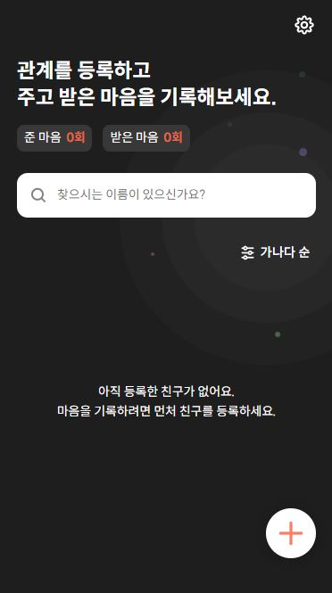

## 별자취 앱을 만들다가 애니메이션 효과를 플로팅 버튼에 주고 싶었다.



#

우리가 만들고 있는 별자취 앱의 메인 화면에 보면 + 모양의 플로팅 버튼이 존재한다. 이 버튼을 누르게 되면 '관계 등록하기', '마음 기록하기'라는 버튼들이 등장하게 되는데, 플로팅 버튼 형식으로 등장하게 된다.

#


#

그런데 지금은 이 화면으로 전환될 때, 0.3초간의 transition을 거쳐 전환되는 부드러운 애니메이션이 존재하는데 원래 화면으로 돌아갈 때는 이런 애니메이션이 존재하지 않았다. 그래서 나는 원래 화면으로 돌아갈 때도 부드러운 효과를 주고 싶었다.

#

현재 코드 :

#

\_main.scss

```scss
.MainRegister {
  width: 100vw;
  height: 100vh;
  background: rgba(0, 0, 0, 0.6);
  position: fixed;
  left: 0;
  top: 0;
  z-index: 9999;
  opacity: 1;
  animation: fade 0.3s forwards ease;
}

//animation
@keyframes fade {
  0% {
    opacity: 0;
  }
  100% {
    opacity: 1;
  }
}
```

#

Main.tsx

```typescript
...
{registerBtn ? <MainRegister handleRegisterBtn={handleRegisterBtn}
    isEmptyList={isEmptyList}  /> :
    <button type="button" className="add-btn" onClick={handleRegisterBtn}>
        <span className="add-btn-plus"></span>
    </button>
}
...
```

보통의 경우라면 가령 MainRegister 의 className이 'mainRegister'라는 문자열로 되어 있다고 가정하면 mainRegister 가 사라져야 하는 경우에는 scss 파일에

.mainRegister .fade-out 이라고 두고 안에 fade-out을 시키는 css 문법을 작성함으로써, add-btn 이 클릭될 때마다 boolean 변수를 둬서

```typescript
<MainRegister {`MainRegister ${registerBtn ? "" : "fade-out"}`}>
```

이런 식으로 코딩함으로써 애니메이션 효과를 줄 수 있었을 것이다. 하지만 나의 경우에는 조금 까다로운 문제가 있었는데, 그것은 뭐냐면 Main.tsx 단에서 close 이벤트가 일어날 때, registerBtn 이라는 변수가 삼항 연산자로 MainRegister를 보여줄 지, button 태그를 보여줄 지를 결정하는 데, 저것때문에 MainRegister에서 fade out 애니메이션을 채 보여주기도 전에 MainRegister는 Main 컴포넌트에서 detatch 되는 상태가 되버린다. 즉 컴포넌트 자체가 사라져버려 애니메이션 효과라 쓸모가 없다.

### 해결법

그러자면 먼저 Main.tsx 의 코드를 고쳐야 한다.

#

```typescript
{!registerBtn ?
    <button type="button" className="add-btn" onClick={handleRegisterBtn}>
        <span className="add-btn-plus"></span>
    </button> : null
}
<MainRegister
    registerBtn={registerBtn}
    handleRegisterBtn={handleRegisterBtn}
    isEmptyList={isEmptyList}
/>
```

#

그리고 css에도 코드를 추가한다.

```css
&.fade-out {
  visibility: hidden;
  animation: fadeout 0.5s forwards ease;
}
```

#

여기에서 transition : 0.5s는 넣어준 이유가 animation에도 0.5s가 들어가 있지만, 위 사진에도 보여지듯이 MainRegister가 보여지고 등록 버튼들이 보여질 때 배경색도 같이 흐릿하게 변경되는 효과를 주었었다. transition 0.5s 를 빼니까 어떤 일이 일어나나면 버튼들은 0.5초에 걸쳐 서서히 사라지는데 배경색은 바로 변경이 되어 이 갭으로 인한 괴리감이 들었다. 그래서 배경색에도 서서히 사라지는 효과를 주기 위해 transition : 0.5s 라고 추가한 것이다.
