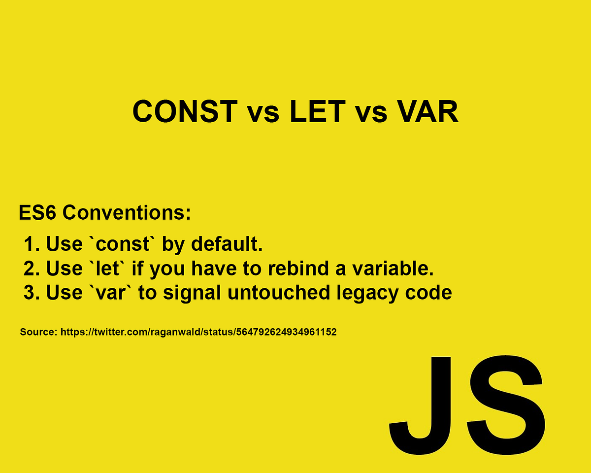

## 1. var, let, const 의 차이점

- var : 자바스크립트의 기본적인 변수 선언자. 특징으로는 재할당이 가능하다(즉, 처음 변수 선언할 때 할당해준 값을 변경 가능하다.), 변수 선언을 중복해서 하여도 에러가 발생하지 않는다.

- let : ECMAScript 6 부터 추가된 선언자. var처럼 재할당을 해줄 수 있다는 점은 var와 같으나, 변수 선언을 중복해서 하게 되면 에러가 발생한다는 것이 var와 다른 점이다.

- const : ECMAScript 6 부터 추가된 선언자. var, let과는 다르게 재할당을 허용하지 않는다. 또한 변수 선언을 중복해서 하는 것도 허용하지 않는다.

#

#### 호이스팅에서의 차이점

var, let, const 는 호이스팅에 있어서 어떤 차이점을 가지고 있을까?

- var

var는 변수 호이스팅(코드 윗부분이 아닌 중간 부분에 변수 선언이 있어도 에러가 나지 않는 현상) 현상을 허용한다.

```javascript
console.log(foo) // undefined 출력
foo = 123

console.log(foo) // 123 출력
```

즉 위와 같이 변수 초기화(= 123) 부분은 위로 올려지지 않지만 foo 라는 변수 선언 자체는 위로 끌어올려진 것처럼 보인다. 그래서 끌어올리다는 뜻을 가진 hoist 라는 용어를 써서 해당 현상을 호이스팅 이라고 표현한다.

- let

let은 어떨까? let의 경우에는 에러가 발생한다.

```javascript
console.log(foo) // Reference Error : Cannot access 'foo' before initialization
let foo
```

위 처럼 foo 라는 변수는 초기화가 되지 않았으므로 접근할 수 없다는 에러가 표시된다. 주목할 것은 다른 Java, C 언어처럼 '변수가 정의되지 않았습니다.','변수를 찾을 수 없습니다.' 같은 에러가 아니라 초기화 에러가 발생한다는 점에 주목해보자.

우리는 var의 경우, 변수 선언보다 console.log 로 변수 출력을 먼저 실행하면 undefiend가 출력되는 것을 알 수 있다. 자바스크립트는 프로그램을 실행할 때, "선언 단계", "초기화 단계"를 거치게 된다. var는 변수 선언과 undefined로의 초기화가 함께 일어나는 것처럼 보인다. 즉, var는 선언 단계 - 초기화 단계가 한번에 진행된다.

let은 반면에, "선언 단계"와 "초기화 단계"가 분리되어 진행된다. 그러므로 let은 var와 같이 변수 선언이 다른 코드의 실행보다 앞서 실행되는 것은 공통이지만 초기화는 프로그램의 본격적인 실행 단계에서 진행되므로 변수 선언 코드보다 윗부분에서 해당 변수를 이용하려고 하면 참조 에러가 발생하는 것이다.

#


#

## 2. 그렇다면 언제 사용할까?

var, let, const라는 세가지 선언자는 각각 어느 경우에 사용하는 것이 적절할까? 어떤 변수를 선언할 때 var, let, const를 사용하는 것일까? 아래에 그 예시가 있다.



1. 먼저 const를 기본으로 사용해라.

2. 그 다음, reassign, 값의 재할당이 필요한 변수는 let으로 선언해라.

3. var 는 legacy code를 수정할 때만 가급적 사용해라.

-> 즉, 기본적으로 변수 선언할 때는 const를 기본으로 쓰는 것이 프로그램의 오류를 줄일 수 있는 방법이며, 재할당이 필요한 변수들은 let으로 선언하도록 권장하고 있다. var 는 old version이라는 얘기.
